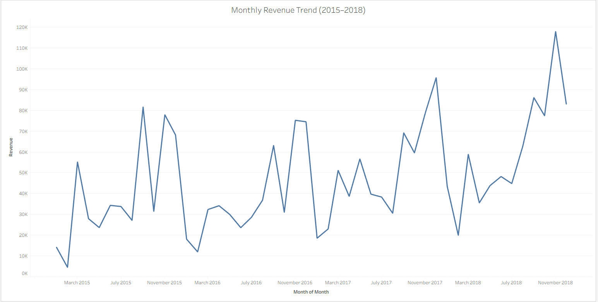
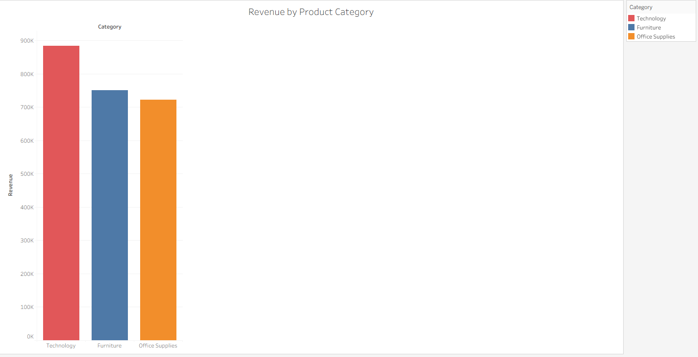
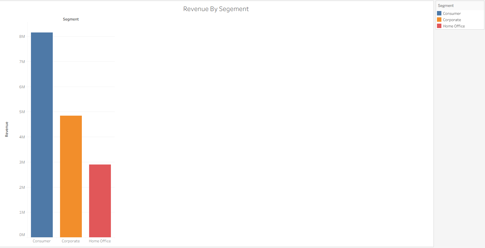
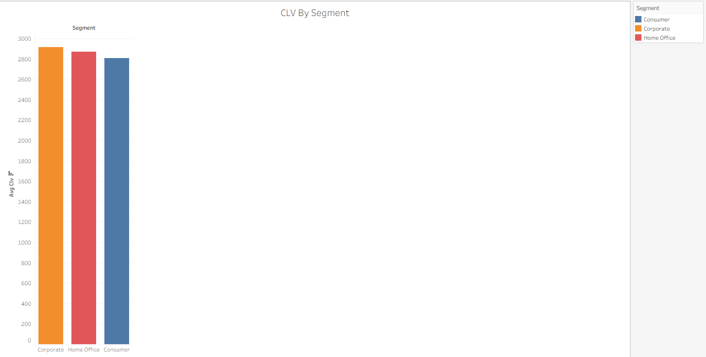

# Retail Sales Performance & Customer Behaviour Analysis

---

## Project Overview

The goal of this project was to analyse retail sales data to uncover revenue trends, customer behaviour, and the most valuable customer segments.

The analysis combines SQL data modelling with Tableau visualisations to answer key business questions that could guide marketing and product strategy.

---

## Business Problem

Retail companies generate large volumes of transactional data but often lack clear insights into:

- Revenue trends  
- Customer behaviour  
- Product performance  
- Marketing strategy effectiveness  

This project analyses retail transaction data to uncover key revenue drivers and customer behaviour patterns.

---

## Tools Used

- **SQL (MySQL)** – data cleaning, transformation, and analysis  
- **Python (Pandas)** – data loading and preparation  
- **Tableau** – data visualisation  
- **Data modelling** – fact and dimension tables  

---

## Dataset

This raw dataset was cleaned and transformed into fact and dimension tables before analysis.

The dataset contains transactional retail sales data including:

1. Order details  
2. Customer segments  
3. Product categories  
4. Shipping information  

---

## Data Pipeline

Steps taken:

1. Raw CSV data loaded using Python  
2. Data cleaned and imported into MySQL  
3. Fact and dimension tables created  
4. SQL queries used to analyse revenue and customer behaviour  

---

## Key Business Questions

1. How has revenue changed over time?  
2. Do a small number of customers drive most revenue?  
3. How valuable are repeat customers?  
4. Which products generate the most revenue?  
5. Which customer segments are most valuable?  
6. What is the customer lifetime value?  

These questions mirror real business decisions.

---

## Data Visualisations

### Monthly Revenue Trend

Revenue steadily increased between 2015 and 2018, with several noticeable spikes toward the end of each year. This suggests a seasonal sales pattern where demand increases during the holiday period.

The overall upward trend indicates consistent business growth across the analysed time period.

---

### Revenue by Product Category

Technology generated the highest overall revenue among the three product categories, followed by Furniture and Office Supplies.

This suggests that technology products are the primary revenue driver for the business and may represent a key area for continued investment or promotion.

---

### Revenue by Customer Segment

The Consumer segment generated the largest share of total revenue, significantly outperforming both Corporate and Home Office segments.

This indicates that individual consumers represent the largest portion of the customer base and contribute most to overall sales volume.

---

### Customer Lifetime Value (CLV) by Segment

Corporate customers have the highest average customer lifetime value, slightly outperforming the Home Office segment and noticeably exceeding the Consumer segment.

This suggests that although Consumer customers generate more total revenue, Corporate customers tend to spend more per customer over time.

---

## Key Insights

### Revenue Concentration

Top 10% of customers generated **31% of total revenue**, highlighting the importance of retaining high-value customers.

### Customer Loyalty

Repeat customers generated **99.7% of revenue**, demonstrating that retention strategies are critical for growth.

### Product Performance

Phones were the highest-revenue sub-category, generating **£354K**, making them a key product driver.

### Customer Segments

Corporate customers delivered the highest average **CLV (£2.9K)**, while Home Office contained the highest individual spenders.

---

## Business Recommendations

- Introduce loyalty programs for repeat customers  
- Increase marketing targeting Corporate customers  
- Promote high-performing products such as phones  
- Identify and retain high-value Home Office customers  
